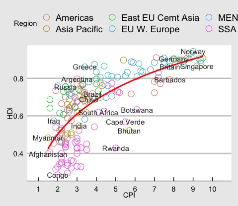

# Corruption-Development
## An R plot describing the relation between Corruption and Development .
### This repository is also an Intro to R specifically focusing on ggplot2.
#### To know more about this plot , please read this article : https://www.economist.com/graphic-detail/2011/12/02/corrosive-corruption. 
 
